# hangman-v2

This is a repository for the Gnome's course in Eilixir. 
It coverts processes with OTP, application architecture and also Phoenix and Phoenix LiveView.
Even if I (or you) don't agree with everything, there is still a lot to be learned for sure !

Each application has a README file detailing the lessons learned and a quick usage guide. 
Since each application is quite simple, I feel like no addtional information is needed before jumping into the code. 

The versions of Elixir/Erlang and Phoenix used for all the apps are the following:
- Elixir 1.13.1
- Erlang OTP 24
- Phoenix 1.6.5

## .gitattributes

The Dicionary app has a list of words. Normally this would pose no issue, but on windows Elixir's file read will return `\r` characters
and the end of each word, screwing them up. To fix it,  I recommend you use GIT to for LF return on all files:

- https://stackoverflow.com/a/42136008/1337392

## IEx config

This project comes with a `.iex.exs` configuration file that makes the `iex` look really nice. 
I recommend its usage, as readability is highly improved for most cases. However to be able to use it in Windows, a change in the registry is needed:

- Enabled ANSI Colors (https://superuser.com/a/1300251/222770)

## Dependencies Graph

Following is a dependencies graph between the different applications.
These are uniderectional dependencies, often a good sign of a good architecture.

The `->` arrow means, "Used By"

