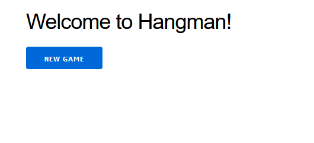
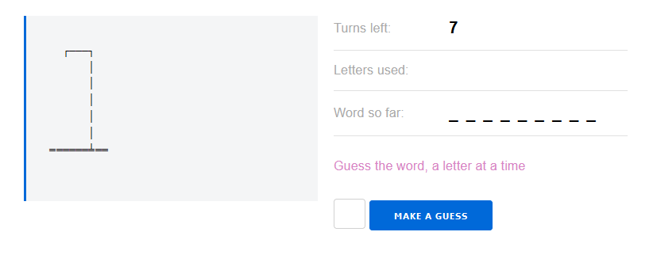
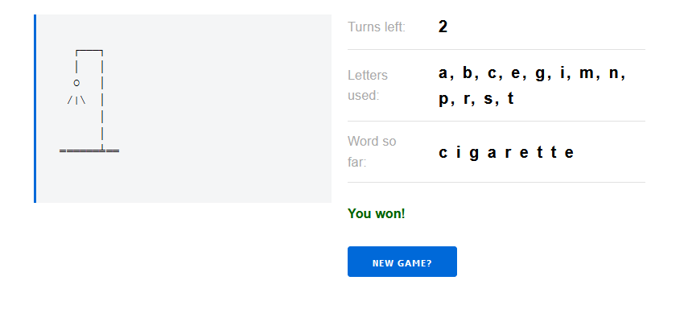

# HtmlApp

This is a Phoenix Application of a Hangman game. 

You can start a new Game:

Play it:

And repeat!

Each time a new game is started a new `Hangman` server is started, so you can have many Hangman games at the same time!

## See it in action

To start your Phoenix server:

  * Install dependencies with `mix deps.get`
  * Start Phoenix endpoint with `mix phx.server` or inside IEx with `iex -S mix phx.server`

Now you can visit [`localhost:4000/hangman`](http://localhost:4000/hangman) from your browser.
Once started your game will be saved at [`localhost:4000/current`]((http://localhost:4000/current). It will remain there until it expires by user inactivity (1 hour default).

## Things I learned

The Gnome's standard is as follows:
 - This app was created with `--no-ecto --no-mailer --no-gettext --no-dashboard`. We don't need them!

