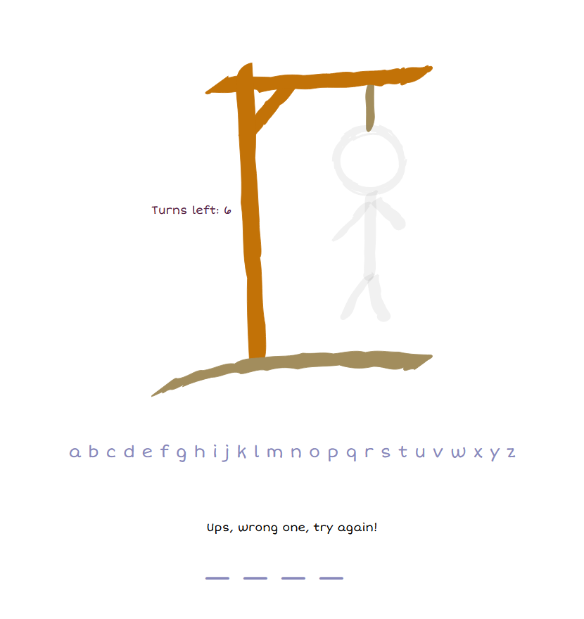

# LiveApp

This is a Phoenix LiveView Application of a Hangman game. 

Here you can play the game by

 - pressing a letter in the keyboard
 - OR by clicking the letters in the alphabet

This is achieved by using `phx-` events to decouple who/what sends messages from who/what receives them.

Each time you reload the page a new game starts !

## See it in action

To start your Phoenix server:

  * Install dependencies with `mix deps.get`
  * Start Phoenix endpoint with `mix phx.server` or inside IEx with `iex -S mix phx.server`

Now you can visit [`localhost:4000`](http://localhost:4000) from your browser.

## Things I learned

The Gnome's standard is as follows:
 - This app was created with `--no-ecto --no-mailer --no-gettext --no-dashboard`. We don't need them!
 - `lib/live_app` folder is for application logic. We don't have that here so it is empty.
 - `lib/live_app_web` folder is for front-end code. This is what we will be working with!
 - Since this is a LiveView App, we won't be using controllers. We delete the `controllers` folder and replace it with a `live` folder!
 - `lib/live_app_web/live` folder is where our live code and `live_components` will be (a `live_component` is a part of a `live` view).
 - `lib/live_app_web/templates` folder is where our shared html files are and the `lib/live_app_web/views` code is where Elixir funciton helpers for those html files live.
 - In the router, we don't use the typical `get`, `put`, `post`, etc. Our endpoints are `live` instead !
 - CSS for our app lies in the `assets/css/app.css` file and we have to change it to have nice looking apps.
