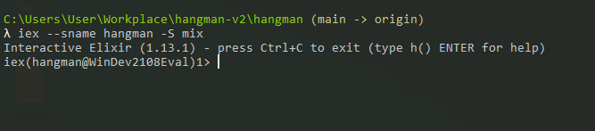
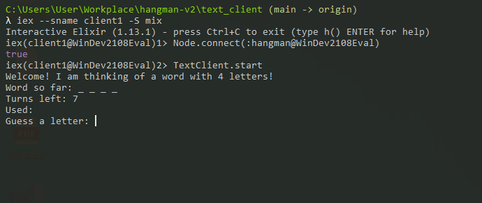

# TextClient

This is a TextClient that can connect to a Remote `Hangman` server. 
This means with only 1 `Hangman` server running you can have multiple TextClients.

## How to play it?

To play it you need at least 2 Terminal Windows. 

Start the `Hangman` server:

`iex --sname hangman -S mix`



Start as many `TextClient` clients as you want and connect them to the server:

```bash
iex --sname client1 -S mix
Node.connect(:hangman@MACHINE_NAME_HERE)
TextClient.start
```



The clients can have any name they want, but the server **MUST** be callend `hangman`.

## Things I leaned

The Gnome's teachings can be summarized as follows:
- I leared how to use `--sname` and `--name` with `iex`. This allows Nodes to connect to each other, while with `--sname` the Nodes must be in the same machine, with `--name` they can be in a different machine in any part of the world.
- **DO NOT** use `:rpc.call` to do things between Nodes on different machines nor in real life apps. It has no security whatsoever. You could use a VPN or SSH tunel to do it, but you are better off using frameworks that already leverage all the power of Erlang Node communication and do it much safer, like Phoenix.
- `lib/text_client` is the Public API of this app. 
- `lib/impl` has the implementation logic of the app. All the code that can be tested, the *Functional Requirements* are there.
- `lib/runtime` has the runtime loic or the *NonFunctional Requirementes*. This is code that deals with SuperVisors, Genservers, etc. 
- Although this application has access to the code of `Hangman`, it does not launch it. Normal applications do this with every dependency, but here because we have `included_applications: [:hangman]`, the dependecy will be compiled, but not launched. This is great if we just want access to the API of a dependency, but we do not want to incurr in the overhead of actually running it.